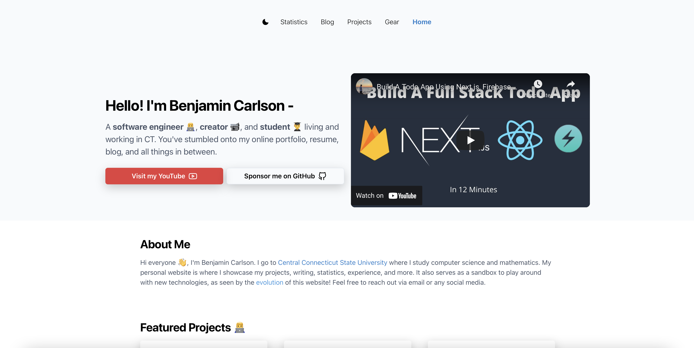
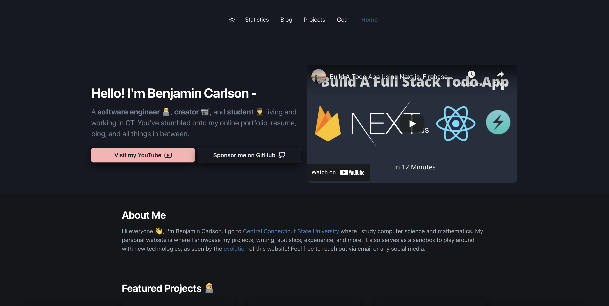

<div align="center">
  <h1>benjamincarlson.io</h1>
  </img>
  </img>
</div>

## Overview

My personal portfolio website hosted at [https://benjamincarlson.io](https://benjamincarlson.io). My personal website has changed over the years - from a static HTML/CSS/JS site to Wordpress to Jekyll to Gatsby to Django (I made a site with django but never deployed it due to it costing so much!) and finally to Next.js/React. This site has my writing, projects, gear, tutorials, experience, and much more.

Feel free to fork this repo and make it into your own website! Below you will find instructions, features, and the tech stack.

## Running Locally

To run locally you must

1. Clone this repo

```bash
git clone https://github.com/bjcarlson42/benjamincarlson.io.git
```

or

```bash
git clone https://github.com/bjcarlson42/benjamincarlson.io.git .
```

2. Create a .env file and enter your secret keys (if you skip this step the site will still run but some data won't be fetched)

```bash
touch .env
```

Inside ```.env```:

```
YOUTUBE_KEY=

GITHUB_KEY=

BUTTONDOWN__KEY=

FIREBASE_CLIENT_EMAIL=
FIREBASE_PROJECT_ID=
FIREBASE_PRIVATE_KEY=

STRAVA_CLIENT_ID=
STRAVA_SECRET=
STRAVA_REFRESH_TOKEN=
```

3. Move into the project root and remove git tacking (if you are planning to submit a PR to this repo don't do this step!)

```bash
rm -rf .git*
```

4. Install dependencies

```bash
yarn
```

5. Run locally!

```bash
yarn dev
```

Navigate to [http://localhost:3000](http://localhost:3000).

## Features

- Light/Dark mode
- Realtime Statistics via SWR and Nex.js API routes
- Responsive Design
- Blog
- Google Analytics
- Google AdSense

## Tech Stack

- JS Framework: [Next.js](https://nextjs.org/)
- CSS Framework: [Chakra UI](https://chakra-ui.com/)
- Blog Code Syntax: [Prism.js](https://prismjs.com/)
- Blog: [next-mdx-remote](https://github.com/hashicorp/next-mdx-remote)
- Database(Blog post view and like count): [Firebase](https://firebase.google.com)
- Deployment: [Vercel](https://vercel.com/)

## Contributing

Contributions are welcome! Feel free to tackle an issue or even implement a new feature. Simply submit a PR and I'll take a look.
